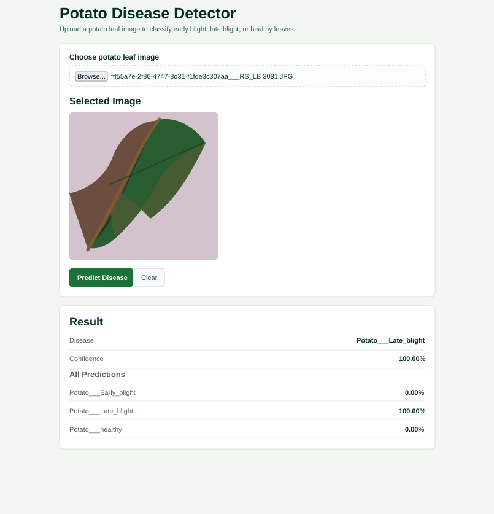

# Potato Disease Classification

This project detects potato leaf disease from an uploaded image. It classifies images into:

- `Potato___Early_blight`
- `Potato___Late_blight`
- `Potato___healthy`



The project contains a PyTorch CNN model, a FastAPI backend for local inference, a React frontend, and a Google Cloud Function deployment version.

## Project Structure

```text
api/             Local FastAPI backend
frontend/        React frontend
potato/          PyTorch model architecture, config, and training notebook
gcp/             Google Cloud Function deployment files
server/          TorchServe handler
tests/           Backend tests
```

## Local Backend

From the project root:

```bash
cd /home/nathiskar/potato_diseases
```

Activate your Python environment:

```bash
conda activate cnn
```

Install dependencies:

```bash
pip install -r requirement.txt
pip install torch torchvision --index-url https://download.pytorch.org/whl/cpu
```

Run the backend:

```bash
uvicorn api.main:app --reload --host 0.0.0.0 --port 8000
```

API docs:

```text
http://localhost:8000/docs
```

Health check:

```text
http://localhost:8000/health
```

## Frontend

Open a second terminal:

```bash
cd /home/nathiskar/potato_diseases/frontend
npm install
npm run dev
```

Open:

```text
http://localhost:5173
```

The frontend sends prediction requests to:

```text
http://localhost:8000/predict
```

## Google Cloud Function Deployment

The `gcp/` folder is used for deploying the model as a Google Cloud Function.

The deployed function downloads the model from this Cloud Storage bucket on first request:

```text
gs://torch-potato-disease-classification-12/models/model_0.1.pth
```

It stores the downloaded model at:

```text
/tmp/model_0.1.pth
```

Later requests reuse the downloaded and loaded model.

Before deployment, make sure these APIs are enabled:

```bash
gcloud services enable cloudfunctions.googleapis.com
gcloud services enable cloudbuild.googleapis.com
gcloud services enable run.googleapis.com
gcloud services enable artifactregistry.googleapis.com
gcloud services enable eventarc.googleapis.com
gcloud services enable storage.googleapis.com
```

Deploy from inside the `gcp` folder:

```bash
cd /home/nathiskar/potato_diseases/gcp

gcloud functions deploy predict \
  --gen2 \
  --runtime python310 \
  --region asia-south1 \
  --source . \
  --entry-point predict \
  --trigger-http \
  --allow-unauthenticated \
  --memory 2Gi \
  --timeout 300s
```

Current deployed function URL:

```text
https://asia-south1-potato-disease-classifciation.cloudfunctions.net/predict
```

Test with:

```bash
curl https://asia-south1-potato-disease-classifciation.cloudfunctions.net/predict
```

Prediction test:

```bash
curl -X POST "https://asia-south1-potato-disease-classifciation.cloudfunctions.net/predict" \
  -F "file=@/path/to/potato_leaf_image.jpg"
```

## Important Git Notes

Do not commit local secrets or large generated files. The `.gitignore` excludes:

- `key_file.json`
- model files such as `.pth`, `.pt`, `.mar`
- `node_modules/`
- build output such as `frontend/dist/`
- logs and cache folders
- dataset archives

The model file should be stored in Google Cloud Storage, not committed to GitHub.

## Tech Stack

- Python
- PyTorch
- FastAPI
- React
- Vite
- Google Cloud Functions Gen 2
- Google Cloud Storage
